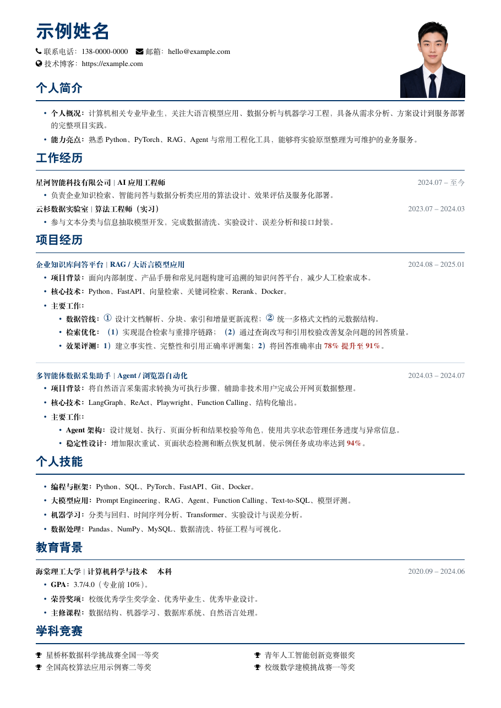
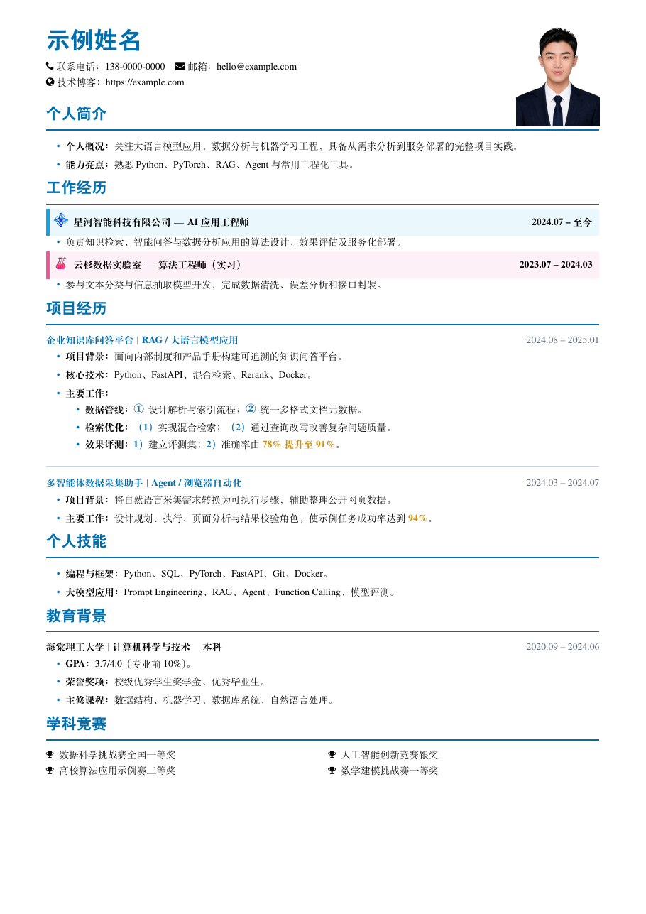
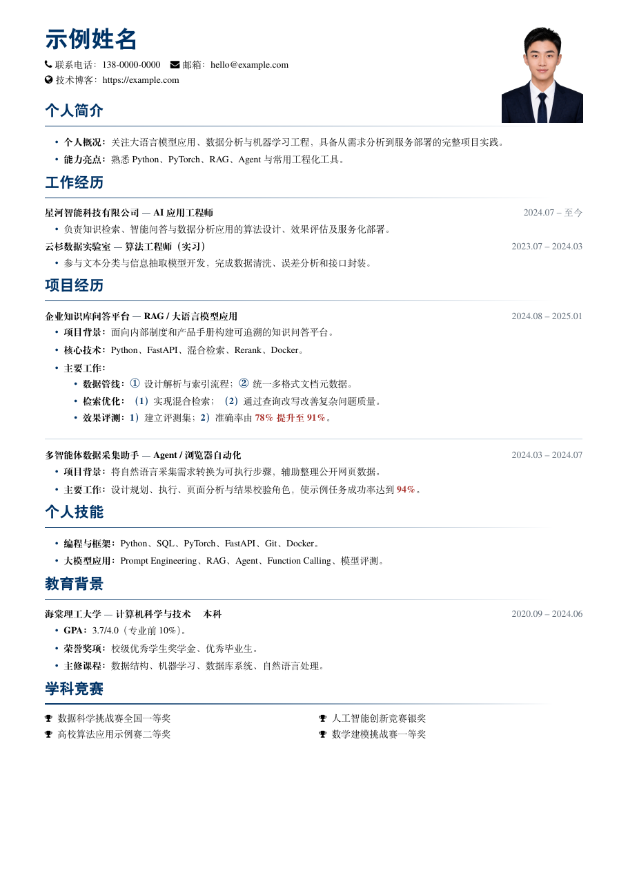
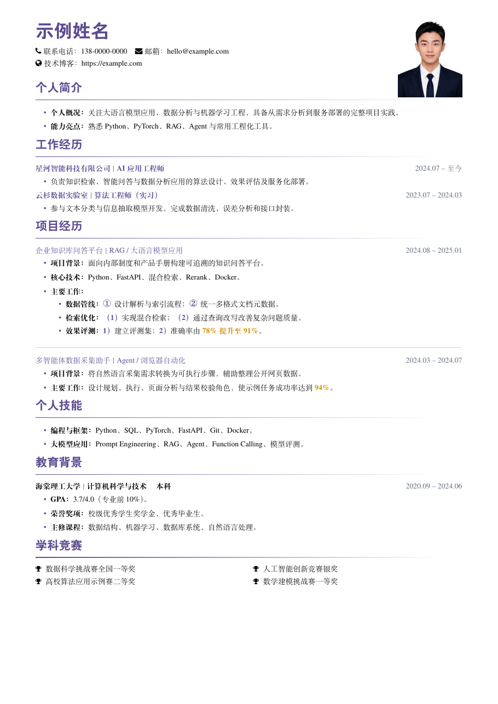
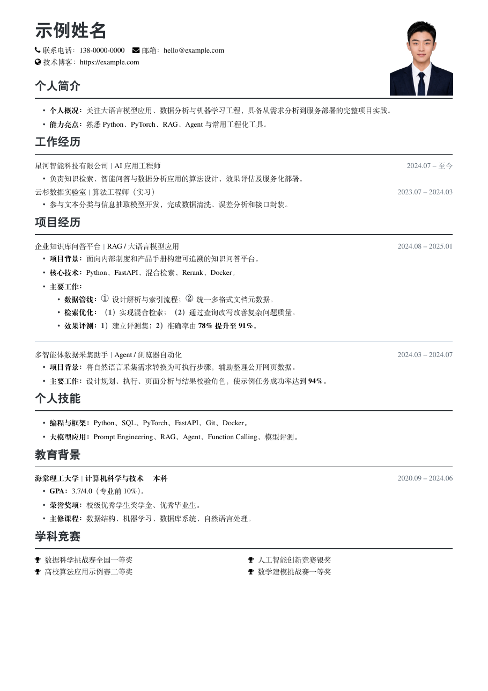

# SimpleCNResume-LaTeX-Template

<p>
  <a href="README.md"></a>
  <a href="README.zh-CN.md"></a>
</p>

A clean, configurable, general-purpose LaTeX template for Chinese résumés. Resume content stays in `resume.tex`, while typography, spacing, colors, and reusable components live in `simplecnresume.cls`.

## Preview gallery

Click a preview to open its PDF. Each preset uses the same content structure so the layout differences are easy to compare.

<table>
  <tr>
    <td width="50%" align="center">
      <strong>Recommended default</strong><br>
      <a href="resume.pdf"></a><br>
      <a href="resume.tex">Source</a>
    </td>
    <td width="50%" align="center">
      <strong>Modern color blocks</strong><br>
      <a href="examples/modern-colorblocks.pdf"></a><br>
      <a href="examples/modern-colorblocks.tex">Source</a>
    </td>
  </tr>
  <tr>
    <td width="50%" align="center">
      <strong>Classic clean</strong><br>
      <a href="examples/classic-clean.pdf"></a><br>
      <a href="examples/classic-clean.tex">Source</a>
    </td>
    <td width="50%" align="center">
      <strong>Purple light</strong><br>
      <a href="examples/purple-light.pdf"></a><br>
      <a href="examples/purple-light.tex">Source</a>
    </td>
  </tr>
  <tr>
    <td width="50%" align="center">
      <strong>Minimal monochrome</strong><br>
      <a href="examples/minimal-mono.pdf"></a><br>
      <a href="examples/minimal-mono.tex">Source</a>
    </td>
    <td width="50%"></td>
  </tr>
</table>

## Features

- Ready for Chinese content and compiled with XeLaTeX.
- Resume content and visual definitions are separated.
- Global controls for color, section rules, entry separators, and font sizes.
- Plain entries and optional logo-based company banners.
- Automatic wrapping for long titles while dates remain right-aligned.
- Multi-page support with basic orphan prevention around sections and entries.
- Black contact and award icons for restrained visual emphasis.
- Included placeholder portrait and logo assets.
- Four additional layout presets with compiled previews.

## Requirements

- TeX Live 2022 or later, or a recent MiKTeX release.
- XeLaTeX as the compiler.
- A complete LaTeX installation. The required English text font is included under `fonts/`.

## Quick start

Clone or download the whole project, then compile from the project root:

```bash
latexmk -xelatex resume.tex
```

Without `latexmk`, run XeLaTeX twice:

```bash
xelatex resume.tex
xelatex resume.tex
```

For Overleaf, upload the entire project, select XeLaTeX, and set `resume.tex` as the main document.

## Project structure

```text
.
├─ resume.tex              # Resume content and user-facing configuration
├─ simplecnresume.cls      # Layout definitions and reusable commands
├─ fontawesome.sty         # Local icon compatibility package
├─ fonts/                  # Bundled font files
├─ images/                 # Portrait and logo assets
├─ previews/               # PNG previews rendered from every PDF
├─ examples/               # Additional presets, source files, and PDFs
├─ LICENSE                 # MIT License
├─ README.md               # English documentation
├─ README.zh-CN.md         # Simplified Chinese documentation
└─ resume.pdf              # Compiled recommended default
```

## Global configuration

Place `\resumesetup` in the preamble of `resume.tex`. Every key is optional; omitted keys keep their defaults.

```tex
\documentclass{simplecnresume}

\resumesetup{
  color=ResumeClassic,
  section-line=solid,
  entry-separator=bar
}
```

| Key | Accepted values | Default | Effect |
| --- | --- | --- | --- |
| `color` | `ResumeClassic`, `ResumeModern`, or a defined color name | `ResumeClassic` | Name, section titles, rules, bullets, number markers, and theme-colored entries |
| `section-line` | `gradient` or `solid` | `gradient` | Gradient or solid rule below each section title |
| `entry-separator` | `dash` or `bar` | `dash` | Separator between an entry title and subtitle |
| `name-size` | Any valid LaTeX length | `22bp` | Name size; the default matches `\zihao{2}` |
| `section-size` | Any valid LaTeX length | `14bp` | Section title size; the default matches `\zihao{4}` |
| `body-size` | Any valid LaTeX length | `9pt` | Body size; line spacing scales automatically |

Adjust only the sizes you need:

```tex
\resumesetup{
  name-size=24pt,
  section-size=15pt,
  body-size=9.5pt
}
```

Larger body text may naturally move content to another page.

### Custom theme color

Define an xcolor color before passing it to `\resumesetup`:

```tex
\definecolor{MyResumeColor}{RGB}{80,90,140}

\resumesetup{
  color=MyResumeColor,
  section-line=solid,
  entry-separator=bar
}
```

The older `gradientline` and `solidline` document-class options and `\setresumecolor{...}` remain compatible.

## Content commands

### Header, contact information, and sections

```tex
\resumeheader[images/avatar.png]{Name}{%
  \resumecontact{\faPhone}{Phone: 138-0000-0000}
  \resumecontact{\faEnvelope}{Email: hello@example.com}\\
  \resumecontact{\faGlobe}{Website: https://example.com}
}

\resumesection{Work Experience}
```

The portrait path is optional. When omitted, the template displays a generic placeholder. Contact icons remain black regardless of the theme color.

### Standard entries

```tex
\resumeentry{Organization or project}{Role or subtitle}{Date}
```

The complete form is:

```tex
\resumeentry*[color][separator]{title}{subtitle}{date}
```

- The star disables bold text.
- `color` defaults to `black` and accepts `ResumePrimary` or any defined color.
- `separator` accepts `dash` or `bar` and otherwise follows the global setting.
- Long titles and subtitles wrap automatically; the date stays aligned to the right.

Examples:

```tex
\resumeentry[black][dash]{University}{Major and degree}{2020.09 -- 2024.06}
\resumeentry[ResumePrimary][bar]{Project name}{Project subtitle}{2024.08 -- 2025.01}
\resumeentry*[black][bar]{Lightweight heading}{Subtitle}{Date}
```

### Company banner with a logo

```tex
\resumebanner[ResumeSky][images/logo-stellar-tech.png]
  {Company name}{Role}{2024.07 -- Present}
```

The first optional argument is the banner color, and the second is the logo path. Pass an empty logo path to use the generic company icon:

```tex
\resumebanner[ResumeOrange][]{Company name}{Role}{Date}
```

### Lists and highlighted results

```tex
\begin{resumeitems}
  \item \textbf{Responsibility:} Designed the workflow and delivered the service.
  \item \textbf{Result:} Accuracy reached \resumehighlight{91\%}.
\end{resumeitems}
```

`\resumehighlight` uses `ResumeAccent` by default. Choose the bundled gold color or define your own:

```tex
\resumehighlight{78\% to 91\%}
\resumehighlight[ResumeGold]{2.4k stars}

\definecolor{MyHighlightColor}{RGB}{160,90,180}
\resumehighlight[MyHighlightColor]{Custom highlight}
```

### Inline numbering inside descriptions

Use the number commands after a bold mini-heading, without adding manual spaces:

```tex
\begin{resumedetails}
  \item \textbf{Pipeline:}\resumecircled{1}First step;\resumecircled{2}second step.
  \item \textbf{Retrieval:}\resumeparen{1}First item;\resumeparen{2}second item.
  \item \textbf{Evaluation:}\resumerightparen{1}First metric;\resumerightparen{2}second metric.
  \item \textbf{Reliability:}A regular description without numbering.
\end{resumedetails}
```

The commands render `①②`, `（1）（2）`, and `1）2）`. `\resumecircled` already includes its visual scaling, baseline correction, and trailing spacing.

### Education

```tex
\resumeentry[black]{University}{Major \quad Degree}{Start -- End}
\begin{resumeitems}
  \item \textbf{GPA:} 3.7/4.0 (top 10\%).
  \item \textbf{Honors:} Scholarship, outstanding graduate.
  \item \textbf{Coursework:} Data structures, databases, machine learning.
\end{resumeitems}
```

### Awards and competitions

```tex
\resumesection{Awards}
\begin{resumeawards}
  \resumeaward{Competition award}
  \resumeaward{Scholarship or academic honor}
  \resumeaward{Innovation contest award}
  \resumeaward{Modeling contest award}
\end{resumeawards}
```

`resumeawards` uses black trophy icons and arranges items in two columns.

## Style presets

Preset source files and compiled PDFs are stored in `examples/`. They share `examples/example-content.tex` and override only style-related commands.

Compile a preset from the project root:

```bash
latexmk -xelatex -output-directory=examples examples/modern-colorblocks.tex
```

## License

Released under the [MIT License](LICENSE).

Copyright (c) 2026 CMYK Labs (cmyk-labs)
